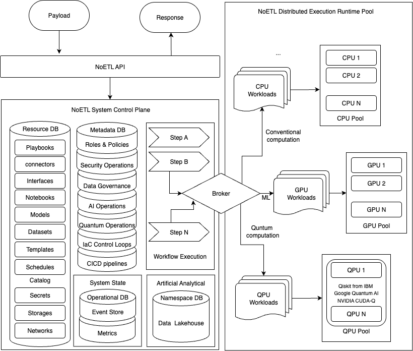

# Not Only ETL

__NoETL__ is an automation framework for data processing and MLOps orchestration.

[](https://badge.fury.io/py/noetl)
[](https://pypi.org/project/noetl/)
[](https://github.com/noetl/noetl/blob/main/LICENSE)

## System Architecture

The following diagram illustrates the main components and intent of the NoETL system:



## Quick Start

### Installation

- Install NoETL from PyPI:
  ```bash
  pip install noetl
  ```

For development or specific versions:
- Install in a virtual environment
  ```bash
  python -m venv .venv
  source .venv/bin/activate
  pip install noetl
  ```
- For Windows users (in PowerShell)
  ```bash
  python -m venv .venv
  Set-ExecutionPolicy -Scope Process -ExecutionPolicy Bypass
  .venv\Scripts\Activate.ps1
  pip install noetl
  ```
- Install a specific version
  ```bash
  pip install noetl==0.1.24
  ```

### Prerequisites

- Python 3.11+
- For full functionality:
  - Postgres database (mandatory, for event log persistent storage and NoETL system metadata)
  - Docker (optional, for containerized development and deployment)

## Basic Usage

After installing NoETL:

### 1. Run the NoETL Server

Start the NoETL server to access the web UI and REST API:

```bash
# Start the server with default settings
noetl server

#  use the explicit start command with options
noetl server start --host 0.0.0.0 --port 8080 --workers 4 --debug

# Stop the server
noetl server stop

# Force stop without confirmation
noetl server stop --force
```

The server starts on http://localhost:8080 by default. You can customize the host, port, number of workers, and enable debug mode using command options.

### 2. Using the Command Line

NoETL provides a streamlined command-line interface for managing and executing playbooks:

- Register a playbook in the catalog
```bash
noetl register ./path/to/playbook.yaml
```

- List playbooks in the catalog
```bash
noetl catalog list playbook
```

- Execute a registered playbook
```bash
noetl execute my_playbook --version 0.1.0
```

- Register and execute with the catalog command
```bash
noetl catalog register ./path/to/playbook.yaml
noetl catalog execute my_playbook --version 0.1.0
```

### 3. Docker Deployment

For containerized deployment:

```bash
# Pull the latest image
docker pull noetl/noetl:latest

# Start the server
docker run -p 8080:8080 noetl/noetl:latest

# with environment variables
docker run -p 8080:8080 -e NOETL_RUN_MODE=server noetl/noetl:latest

# Stop the server
docker run -e NOETL_RUN_MODE=server-stop -e NOETL_FORCE_STOP=true noetl/noetl:latest
```

### 4. Kubernetes Deployment

For Kubernetes deployment using Kind (Kubernetes in Docker):

```bash
# Follow the instructions in k8s/README.md
# Or use the automated deployment script
./k8s/deploy-kind.sh

# To stop the server in Kubernetes, create a job:
kubectl apply -f - <<EOF
apiVersion: batch/v1
kind: Job
metadata:
  name: noetl-server-stop
spec:
  template:
    spec:
      containers:
      - name: noetl-stop
        image: noetl:latest
        env:
        - name: NOETL_RUN_MODE
          value: "server-stop"
        - name: NOETL_FORCE_STOP
          value: "true"
      restartPolicy: Never
  backoffLimit: 1
EOF
```

See [Kubernetes Deployment Guide](k8s/KIND-README.md) for detailed instructions.

## Workflow DSL Structure

NoETL uses a declarative YAML-based Domain Specific Language (DSL) for defining workflows. The key components of a NoETL playbook include:

- **Metadata**: Version, path, and description of the playbook
- **Workload**: Input data and parameters for the workflow
- **Workflow**: A list of steps that make up the workflow, where each step is defined with `step: step_name`, including:
  - **Steps**: Individual operations in the workflow
  - **Tasks**: Actions performed at each step (HTTP requests, database operations, Python code)
  - **Transitions**: Rules for moving between steps
  - **Conditions**: Logic for branching the workflow
- **Workbook**: Reusable task definitions that can be called from workflow steps, including:
  - **Task Types**: Python, HTTP, DuckDB, PostgreSQL, Secret.
  - **Parameters**: Input parameters for the tasks
  - **Code**: Implementation of the tasks

For examples of NoETL playbooks and detailed explanations, see the [Examples Guide](https://github.com/noetl/noetl/blob/master/docs/examples.md).

To run a playbook:

```bash
noetl agent -f path/to/playbooks.yaml
```

## Documentation

For more detailed information, please refer to the following documentation:

> **Note:**  
> When installed from PyPI, the `docs` folder is included in your local package.  
> You can find all documentation files in the `docs/` directory of your installed package.

### Getting Started
- [Installation Guide](https://github.com/noetl/noetl/blob/master/docs/installation.md) - Installation instructions
- [CLI Usage Guide](https://github.com/noetl/noetl/blob/master/docs/cli_usage.md) - Commandline interface usage
- [API Usage Guide](https://github.com/noetl/noetl/blob/master/docs/api_usage.md) - REST API usage
- [Docker Usage Guide](https://github.com/noetl/noetl/blob/master/docs/docker_usage.md) - Docker deployment

### Core Concepts
- [Playbook Structure](https://github.com/noetl/noetl/blob/master/docs/playbook_structure.md) - Structure of NoETL playbooks
- [Workflow Tasks](https://github.com/noetl/noetl/blob/master/docs/action_type.md) - Action types and parameters
- [Environment Configuration](https://github.com/noetl/noetl/blob/master/docs/environment_variables.md) - Setting up environment variables


### Examples

NoETL includes several example playbooks that demonstrate some capabilities:

- **Weather API Integration** - Fetches and processes weather data from external APIs
- **Database Operations** - Demonstrates Postgres and DuckDB integration
- **Google Cloud Storage** - A secure cloud storage operations with Google Cloud
- **Secrets Management** - Illustrates secure handling of credentials and sensitive data
- **Multi-Playbook Workflows** - Complex workflow orchestration

For detailed examples, see the [Examples Guide](https://github.com/noetl/noetl/blob/master/docs/examples.md).

## Development

For information about contributing to NoETL or building from source:

- [Development Guide](https://github.com/noetl/noetl/blob/master/docs/development.md) - Setting up a development environment
- [PyPI Publishing Guide](https://github.com/noetl/noetl/blob/master/docs/pypi_manual.md) - Building and publishing to PyPI

## Community & Support

- **GitHub Issues**: [Report bugs or request features](https://github.com/noetl/noetl/issues)
- **Documentation**: [Full documentation](https://noetl.io/docs)
- **Website**: [https://noetl.io](https://noetl.io)

## License

NoETL is released under the MIT License. See the [LICENSE](LICENSE) file for details.

## UI reformat code

when we use pycharm. before commit in ui use `npx prettier  . --write`
